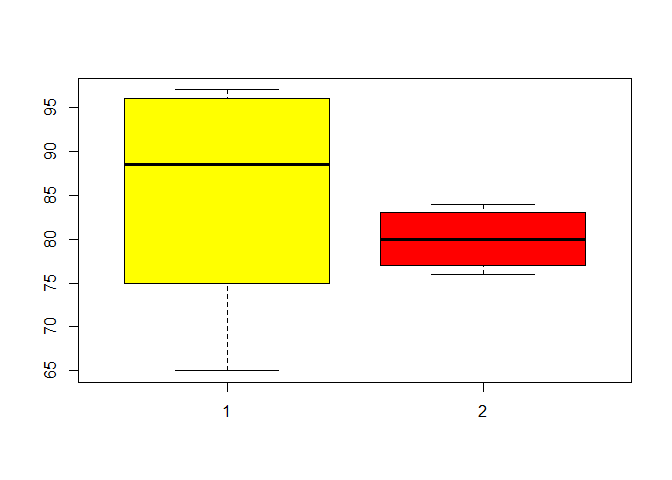

Loading the required Packages
-----------------------------

    library('dplyr')
    library('ggplot2')
    library('statsr')

Question -01
------------

Refer to <a href="Example:1" class="uri">Example:1</a> in “12 DA
CS605.pdf” class slides. Find a P-value for the right-tail test. What is
your conclusion about a significant increase in the number of concurrent
users?

We are given the following: 1.**The number of concurrent users for some
ISP has always averaged 5000 with a standard deviation of 800.**

1.  **After an equipment upgrade, the average number of users at 100
    randomly selected moments of time is 5200.**

### Setting the Hypothesis

### H0 : population mean = 5000

### HA : population mean &gt; 5000

    null_value<-5000 #population_mean
    point_estimate<-5200 #observed extreme
    sd<-800#standard deviaton
    n<-100 #sample size
    alpha<-0.05 #significance
    condition<-qnorm(1-alpha)

### Checking Conditions:

1.  -Independence - We can assume that the data is independent.
2.  -Sample size (100) &lt;10% of the population  

### Drawing Sampling Distributions:

    sample_means = rep(NA, 1000)
    for(i in 1:1000){
      sample_means[i] = mean(rnorm(n =100,mean = 5000, sd=800))
    } 
    sample_means<-data.frame("data"=sample_means)
    sample_means$z_score<- (sample_means$data-null_value)/(800/sqrt(n))
    sample_means$Accept<-ifelse(sample_means$z_score<condition,"Yes","No")
    sample_means$Accept<-factor(sample_means$Accept)
    qplot(x=sample_means$z_score, fill = sample_means$Accept,geom = 'density',
          main='Density plot of sample means')

 \#\#\#
Calculationg Test Statistic

    test_statistic<-(point_estimate-null_value)/(sd/sqrt(n))

### Drawing the plot and shading the P- value

    #P-Value is the area under red color
    p_value<-1-pnorm(test_statistic, mean=0, sd=1)
    p_value<-round(p_value,digits=4)

    ggplot() +
      geom_density(data=sample_means, aes(x=z_score), fill='grey') +
      geom_vline(data=sample_means, 
                 aes(xintercept=test_statistic), 
                 colour="blue", linetype=6, size=1) +
       geom_vline(data=sample_means, 
                 aes(xintercept=condition), 
                 colour="green", linetype=6, size=1) +
      ggtitle("Right Tail Test") -> density_plot
      
    dpb <- ggplot_build(density_plot )
    x1 <- min(which(dpb$data[[1]]$x >=test_statistic))
    x2 <- max(which(dpb$data[[1]]$x <=10))
    density_plot +
      geom_area(data=data.frame(x=dpb$data[[1]]$x[x1:x2],
                           y=dpb$data[[1]]$y[x1:x2]),
                aes(x=x, y=y), fill="red")+annotate(geom="text", x=0, y=0.2, 
                label=paste("P-value = ",p_value),color="red")+
                annotate(geom="text", x=0, y=0.25,
                label=paste("Test Statistic = ",test_statistic),color="red")+
                annotate(geom="text", x=-3, y=0.3, label="Accept H0")+
                annotate(geom="text", x=3, y=0.3, label="Reject H0")+  
                annotate(geom="text", x=test_statistic+0.5, y=0.05, label="P Value")

    rm(list = ls())

### Conclusion

If we infer to reject from significance level of 5% then we can be 90%
sure that the null\_value will not be in the 90% confidence interval As
the P-Value is very very low, we can say that the P(Observed or extreme
outcome| H0 is true) is low enough to reject H0 We can say from the
results inferred from Right -Tail Test that we can agree that there’s a
significant increase in the no of concurrent users

Question -02
------------

A sample of 250 items from lot A contains 10 defective items, and a
sample of 300 items from lot B is found to contain 18 defective items.

    prop_a<-10/250
    prop_b<-18/300
    #Theses are Bernoulli data i.e. only two outcomes defective or not
    #Sucess defined as getting a defective piece

### 1. Implement a 98% confidence interval for the difference of proportions of defective items.

    alpha<-0.02 #98% confidence interval
    point_estimate<-prop_b-prop_a # sample proportions
    standard_error<-sqrt(prop_a*(1-prop_a)/250+prop_b*(1-prop_b)/300) #standard error of sampling distribution
    #Confidence Interval = point estimate +- margin of error
    margin_of_error<-qnorm(1-alpha/2)*standard_error
    Lower=point_estimate-margin_of_error
    Upper = point_estimate+margin_of_error
    confidence_level<-c(Lower,Upper)
    print(confidence_level)

    ## [1] -0.02299655  0.06299655

### Plotting the Confidence Interval

    data1<-data.frame(data=rnorm(100000,mean=point_estimate, sd=standard_error))
    ci<-data1 %>%
            rep_sample_n(size = 50, reps = 50, replace = TRUE) %>%
            summarise(lower = mean(data) -  margin_of_error,
                      upper = mean(data) + margin_of_error)
    ci <- ci %>%
      mutate(capture_mu = ifelse(lower < point_estimate & upper > point_estimate, "yes", "no"))
    ci_data <- data.frame(ci_id = c(1:50, 1:50),
                          ci_bounds = c(ci$lower, ci$upper),
                          capture_mu = c(ci$capture_mu, ci$capture_mu))
    ggplot(data = ci_data, aes(x = ci_bounds, y = ci_id, 
                               group = ci_id, color = capture_mu)) +
      geom_point(size = 2) +  # add points at the ends, size = 2
      geom_line() +           # connect with lines
      geom_vline(xintercept = point_estimate, color = "darkgray") # draw vertical line

    density_plot1<-ggplot(data1)+
                   geom_density(aes(x=data))+
                   geom_vline(xintercept=Lower, colour="pink", linetype=6, size=2) +
                   geom_vline(xintercept=Upper, colour="pink", linetype=6, size=2) +
                   ylim(0,25)+
                   labs(x="Proportion B - Proportion A")+
                   ggtitle("98% Confidence Interval")

    dpb <- ggplot_build(density_plot1 )
    x1 <- min(which(dpb$data[[1]]$x >=Lower))
    x2 <- max(which(dpb$data[[1]]$x <=Upper))
    density_plot1 +geom_area(data=data.frame(x=dpb$data[[1]]$x[x1:x2],y=dpb$data[[1]]$y[x1:x2]),
                             aes(x=x, y=y), fill="black")+
                   annotate(geom="text", x=Lower, y=15, 
                            label=paste("Lower = ",round(Lower,3)), color="grey")+
                   annotate(geom="text", x=Upper, y=15, 
                   label=paste("Upper = ",round(Upper,3)),color="grey")+
                   annotate(geom="text", x=point_estimate, y=5, 
                            label="98% Confidence Interval", color="grey")

 \#\#\# 2.At
a significance level α = 0.02, is there a significant difference between
the quality of the two lots?

### Setting the Hypothesis

### H0 : pa=pb

### HA : pa !=pb

### Calculating Test Statistic

    # The test statistic can be derived as
    null_value<-28/550 #Pooled proportion
    alpha<-0.02 #significance level
    standard_error_hypothesis<-sqrt(null_value*(1-null_value)*(1/250 + 1/300))

    test_statistic<-point_estimate/standard_error_hypothesis

    p_value<-(1-pnorm(test_statistic))*2 #Area as shaded under the graph

### Drawing the plot and shading the P- value

    condition<-qnorm(1-alpha)
    data2<-data.frame(data=rnorm(1000,mean = 0,sd=standard_error_hypothesis))

    density_plot1<-ggplot(data2)+
                   geom_density(aes(x=data), fill ="dark grey")+
                   #geom_vline(xintercept=point_estimate, colour="pink", linetype=6) +
                   #geom_vline(xintercept=-point_estimate, colour="pink", linetype=6) +
                   ylim(0,30)+
                   geom_vline(data=data2, aes(xintercept=-condition*standard_error_hypothesis), 
                              colour="blue", linetype=6, size=1)+
                   geom_vline(data=data2, aes(xintercept=condition*standard_error_hypothesis), 
                              colour="blue", linetype=6, size=1)+
                   labs(x="Proportion B - Proportion A")+
                   ggtitle("Two Tailed Hypotheses Test for difference of Proportions")

    dpb <- ggplot_build(density_plot1 )
    x1 <- min(which(dpb$data[[1]]$x >=point_estimate))
    x2 <- max(which(dpb$data[[1]]$x <=-point_estimate))
    density_plot1 +geom_area(data=data.frame(x=dpb$data[[1]]$x[x1:x2],y=dpb$data[[1]]$y[x1:x2]),
                             aes(x=x, y=y), fill="sky  blue")+
                   annotate(geom="text", x=0, y=10,
                            label=paste("P-value = ",round(p_value,3)))+
                   annotate(geom="text", x=0, y=3,
                            label=paste("Test Statistic = ",round(test_statistic,2)))+
                   annotate(geom="text", x=0, y=15, label="Accept H0")+
                   annotate(geom="text", x=-0.06, y=20, label="Reject H0")+ 
                   annotate(geom="text", x=0.06, y=20, label="Reject H0")  

    rm(list = ls())

Question -03
------------

Ram says to Shyam that he is a stronger student because his average
grade for the first six quizzes is higher. However, Shyam replies that
he is more stable student because the variance of his grades is lower.
The scores are independent and normally distributed

    ram<-c(85,92,97,65,75,96)
    shyam<-c(81,79,76,84,83,77)
    data<-data.frame(cbind(ram,shyam))
    avg_score_ram<-mean(data$ram)
    avg_score_shyam<-mean(data$shyam)
    boxplot(ram,shyam,col=c("yellow","red"))

### 3-1

Is there significant evidence to support Ram’s claim? State H0 and HA.
Test equality of variance and choose a suitable two-sample t-test.
Implement the test at 5% level of significance and derive your
conclusion. \#\#\# Setting the Hypothesis \#\#\# H0 : avg\_score\_ram
-avg\_score\_shyam = 0 \#\#\# HA : avg\_score\_ram &gt;
avg\_score\_shyam

    null_value<-0 
    point_estimate<-5200 
    sd<-800#standard deviation
    n<-100 #sample size
    alpha<-0.05 #significance
    condition<-qnorm(1-alpha)
    t.test(ram,shyam, alternative = "greater", var.equal = F)

    ## 
    ##  Welch Two Sample t-test
    ## 
    ## data:  ram and shyam
    ## t = 0.93062, df = 5.6362, p-value = 0.1951
    ## alternative hypothesis: true difference in means is greater than 0
    ## 95 percent confidence interval:
    ##  -5.56219      Inf
    ## sample estimates:
    ## mean of x mean of y 
    ##        85        80

### Conclusion

-   The *p-value 0.1951* is greater than the alpha = .05 level of
    significance.
-   We don’t have enough evidence to reject H0 that average score of Ram
    is same as that of average score of Shyam
-   This may be because, we have very less data resulting in a higher
    standard error

### 3-2

Is there significant evidence to support Shyam’s claim? Repeat the above
part-1 for this case. \#\#\# Setting the Hypothesis \#\#\# H0 :
var\_score\_ram -var\_score\_shyam = 0 \#\#\# HA : var\_score\_shyam
&gt; var\_score\_ram

    data_ram<-sample_n(data,1000, replace = T)%>%summarise(var=var(data))

    var<-data %>%
            rep_sample_n(size = 6, reps = 10000, replace = TRUE) %>%
            summarise(var_ram =var(ram),var_shyam = var(shyam))

    ## `summarise()` ungrouping output (override with `.groups` argument)

    t.test(var$var_shyam,var$var_ram, var.equal = F)

    ## 
    ##  Welch Two Sample t-test
    ## 
    ## data:  var$var_shyam and var$var_ram
    ## t = -202.57, df = 10057, p-value < 2.2e-16
    ## alternative hypothesis: true difference in means is not equal to 0
    ## 95 percent confidence interval:
    ##  -128.3518 -125.8916
    ## sample estimates:
    ## mean of x mean of y 
    ##   8.67825 135.79994

### Conclusion

-   The *p-value 2.2e-16* is much lower than the alpha = .05 level of
    significance.
-   We have enough evidence to reject H0 that Ram’s score are as stable
    as that of Shyam’score
